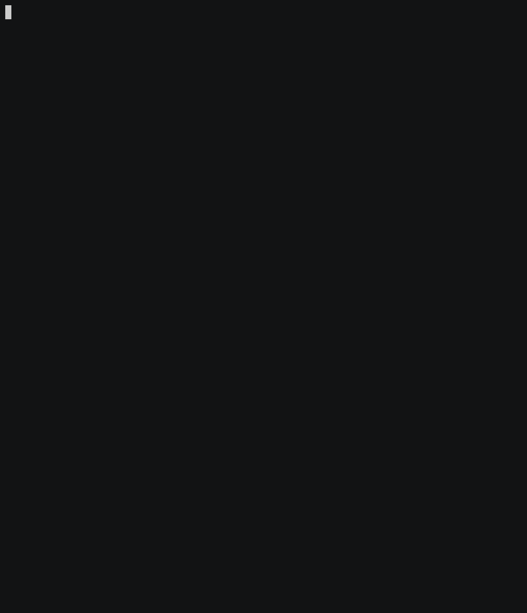

# 🎲 Mixed Messages


[](https://github.com/ArekKrak/mixed-messages)

A JavaScript message generator for displaying **20 top programming languages on the TIOBE Index (August 2025)**.  
Developed as part of the Codecademy *Kanban Project: Mixed Messages*.  

Each run generates:
- A project **title** (ASCII art)
- A **subtitle** (ASCII art)
- A **randomly selected programming language** with:
  - Name  
  - Rank  
  - Popularity rating  
  - ASCII art logo

---

## Project Overview

**Context:**  
The TIOBE Index is updated monthly, ranking programming languages by popularity based on global engineer activity, course availability, and third-party vendors.

**Your role:**  
Create JavaScript objects and functions to build a message generator that outputs at least three pieces of data at random.

**Main Features Implemented:**
- ASCII Art logos included for 20 programming languages.
- A function that selects and displays a random programming language.
- A sleep function using Promises and `async/await` for timed output.
- Clean, structured terminal output.

---

## Tech Stack

- **JavaScript (ES6+)**
- **Node.js** (for running the script locally)
- **Tools**: Visual Studio Code, Git, GitHub

---

## Project Structure

```
mixed-messages/
├── main.js       # Main program logic
└── README.md     # Project documentation
```

---

## How It Works


1. **ASCII title** → printed at program start.  
2. **ASCII subtitle** → introduces the “Top 20 Programming Languages”.  
3. **Random language selection** → chosen from the `top20` array.  
4. **Output** → rank, name, rating, and ASCII logo. 

---

## How to Run

1. Clone the repository:
```
  git clone https://github.com/ArekKrak/mixed-messages.git
  cd mixed-messages
```
2. Run with Node.js:
  - Make sure Node.js is installed:
```
  node -v
```
  - Run the program:
```
  node main.js
```

## Example Output



## Key Concepts Demonstrated

- Objects and arrays in JavaScript
- Randomization with Math.random()
- Asynchronous code with Promise and async/await
- String formatting and ASCII art in Node.js
- Command-line development and Git version control

---

## Future Improvements

- Store ASCII art logos in separate .txt files for easier maintenance.
- Support multiple random picks per run (e.g., top 3).
- Add CLI options for user input (e.g., choose a specific language).
- Add “typing” animation for ASCII output.

---

## Acknowledgements

- Project brief provided by Codecademy.
- ASCII art sourced and adapted for fun, educational purposes.
- TIOBE Index data from August 2025.

---

## Contact
If you're a recruiter, mentor, or fellow developer interested in collaboration or feedback:

**Arek Krakowiak**  
[369arek12@protonmail.com](mailto:369arek12@protonmail.com)

---

Thank you for viewing this project!